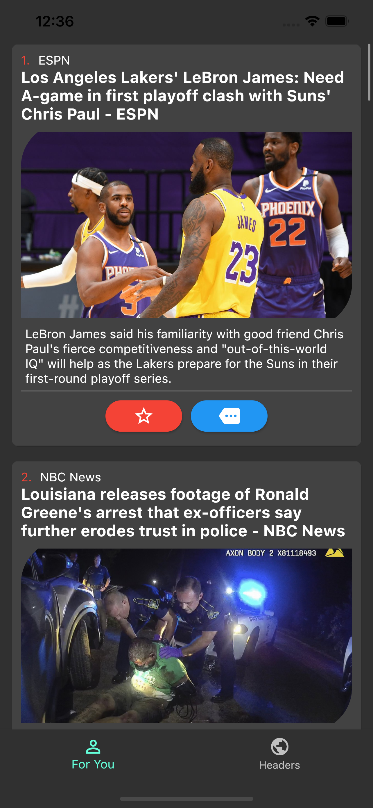
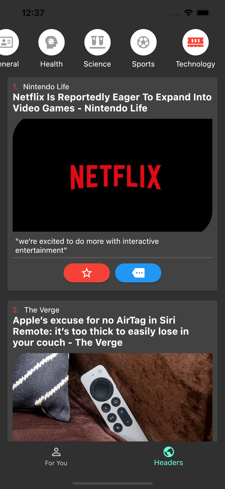

# Flutter News App

This is a study project. In this project, I got information from a News API that gave me data that can be visualized in the app by categories

### General news

### News by category

## what did I learn?
In this project, I learned:

- Implement the Provide pattern
- Keep widgets state when I change the screen to keep the last position of the scroll of a list
- I Made HTTP requests and handle the responses to keep the information in memory to prevent unnecessary requests if I got the information previously

This project improved my skills as a Flutter developer by implementing a layout with a BottomNavigationMenu linked PageView using a Provider to handle the current page selected and communicating with all widgets that depend on the current page.

## Links

- [Flutter Course](https://www.udemy.com/course/flutter-ios-android-fernando-herrera/)
- [News API](https://newsapi.org/)